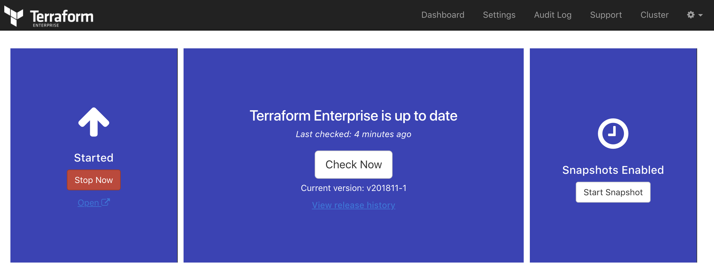

# Terraform Enterprise HA (Beta) Example

This example assumes you have already set up your gcp project with the required prereqs:

* VPC
* Subnet specifically for Terrafrom Enterprise
* Firewall rules as outlined [in the instructions](link_to_website_instructions)
* A valid certificate and ssl policy in gcp. (If you are not going to use a google managed ssl certificate, plesae [read the instructions here on what to comment out](link_to_instructions))
* An IP address and DNS entry for the front end load balancer
* A DNS Zone in gcp
* A license file provided by your Technical Account Manager

With this code you can either create a single instance, or a build a cluster:


_example architecture_

## Change to the example directory

```bash
cd examples/root-example
```

## Install Terraform

Install Terraform if it is not already installed (visit [terraform.io](https://terraform.io) for other distributions):

```bash
../terraform-install.sh
```

## Set the desired options in the module block

You'll need to update the following settings to your set up:

* project: name of the project
* credentials_file: json file name
* public_ip: The IP address to attach to the load balancer
* frontend_dns: DNS name for load balancer
* domain: domain to use
* dns_zone: the name of the dns zone in gcp
* certificate: the api url of the google certficiate to use
* ssl_policy: name of the ssl policy to use
* subnet: subnet to deploy into (this should be reserved for tfe)
* license_file: License file

 This example is set to spin up a single ubuntu instance in demo mode. Please review the top-level (README)[https://github.com/hashicorp/terraform-google-terraform-enterprise/blob/master/README.md] to review other installer options.

## Run Terraform

```bash
terraform init
terraform apply
```

## Wait for the application to load

The installer dashboard url will be output along with the password.

```
application_endpoint = https://tfe.example.com
application_health_check = https://tfe.example.com/_health_check
installer_dashboard_password = hideously-stable-baboon
installer_dashboard_url = https://12.34.56.78:8800
primary_public_ip = 23.45.67.89
```

You can log into that dashboard at that url and wait for the application to be ready. This can take up to 30 minutes! Once complete use the `Open` link to set up the admin user and initial organization. Once the initial admin user and organization are created, you can access and log into the application at the application endpoint.


